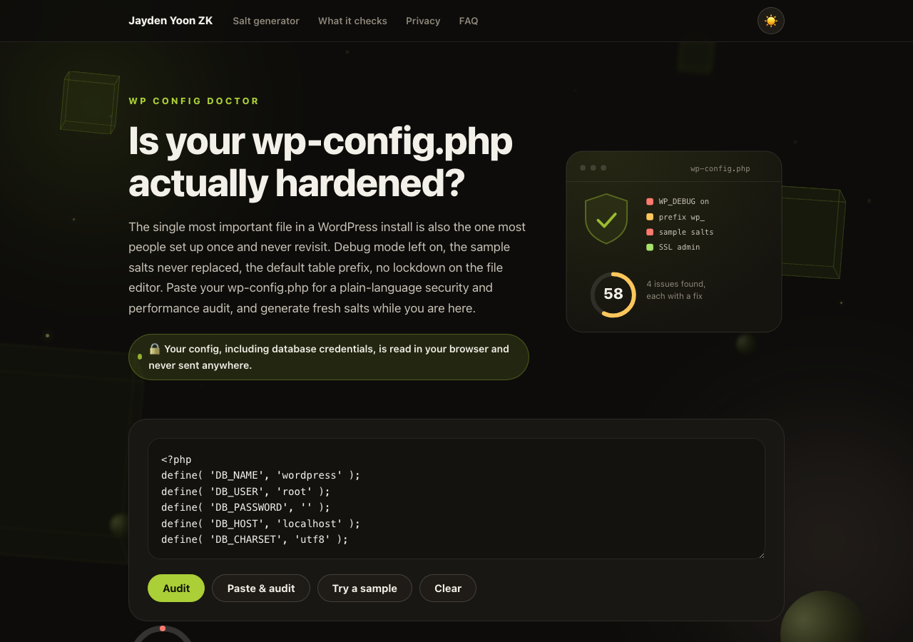

# WP Config Doctor 🩺

Paste your `wp-config.php` and get a plain-language security and performance audit, plus a fresh salt generator. Runs entirely in your browser, so your database credentials never leave your device.

<p>
  <a href="https://jaydenyoonzk.github.io/wp-config-doctor/"></a>
  <a href="https://github.com/JaydenYoonZK/wp-config-doctor/stargazers"></a>
  <a href="LICENSE"></a>
</p>

<a href="https://jaydenyoonzk.github.io/wp-config-doctor/?demo">
  
</a>

**[Open the live tool](https://jaydenyoonzk.github.io/wp-config-doctor/)** or **[see it audit a sample](https://jaydenyoonzk.github.io/wp-config-doctor/?demo)**. Nothing is uploaded.

## Why this exists

wp-config.php is the most important file in a WordPress install, and the one most people configure once and never look at again. The common mistakes are quiet and dangerous: debug mode left on in production leaking server paths, the eight security salts still holding the sample "put your unique phrase here" placeholder, the file editor left open so one stolen admin login becomes full code execution. None of these throw an error. This tool finds them.

## What it checks

Every finding is ranked by severity and comes with the exact line to add or change:

- **Security keys and salts**: all eight present, none still on the sample placeholder, none duplicated, none too short
- **Debug exposure**: `WP_DEBUG`, `WP_DEBUG_DISPLAY`, and a forced `ini_set('display_errors', 1)`
- **Database credentials**: empty or common-default password (checked locally, never shown or sent)
- **File editing**: `DISALLOW_FILE_EDIT`
- **Transport**: `FORCE_SSL_ADMIN`
- **Table prefix**: whether it is still the default `wp_`
- **Hardening and performance extras**: automatic updates, debug log location, environment type, post revisions, memory limit

It also generates eight fresh 64-character salts using the Web Crypto API, safe to paste straight into wp-config.php.

## Is it safe to paste my config here?

Yes. wp-config.php contains your database password, so this is the right question to ask. The page is static and the audit runs entirely in your browser: there are no network requests after load, nothing is stored, and your password is used only to check whether it is empty or a common default, never displayed back or transmitted. Open the network tab to confirm, or read the small [engine](docs/config.js). If you prefer, redact the four `DB_` lines before pasting; the rest of the audit still works.

## Use it

No install: [jaydenyoonzk.github.io/wp-config-doctor](https://jaydenyoonzk.github.io/wp-config-doctor/)

Run locally:

```bash
git clone https://github.com/JaydenYoonZK/wp-config-doctor.git
cd wp-config-doctor
npm run serve   # http://localhost:8411
```

## Use the engine in your own project

`docs/config.js` is a dependency-free ES module:

```js
import { audit, generateSalts } from "./config.js";

const { findings, score } = audit(wpConfigText);
const freshSalts = generateSalts();   // eight define() lines
```

## Tests

```bash
npm test
```

10 tests cover the parser (including salts that contain parentheses and quotes), the audit rules against hardened and insecure fixtures, duplicate-salt detection, and the salt generator.

## License

MIT. Built and maintained by [Jayden Yoon ZK](https://github.com/JaydenYoonZK). Part of a WordPress toolkit with [WP Serial Fix](https://github.com/JaydenYoonZK/wp-serial-fix) and [WP Plugin Checkup](https://github.com/JaydenYoonZK/wp-plugin-checkup).
